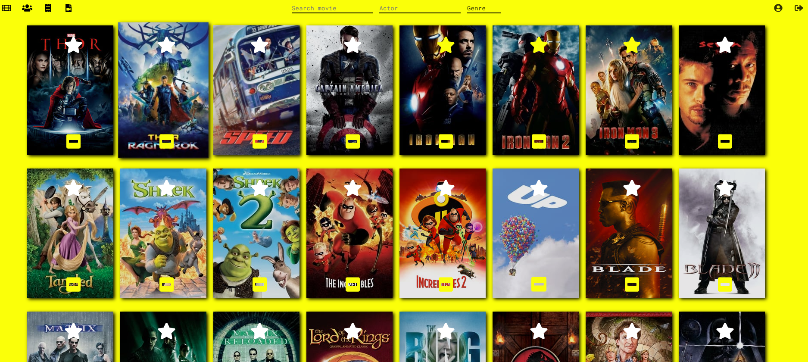
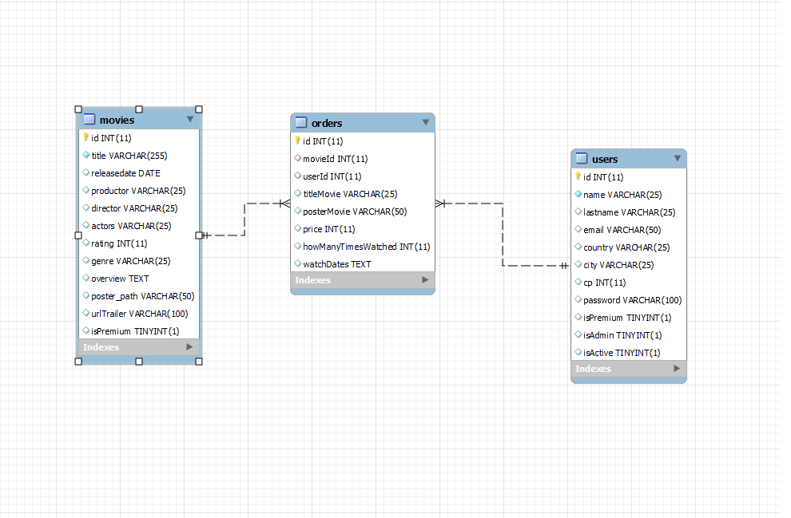
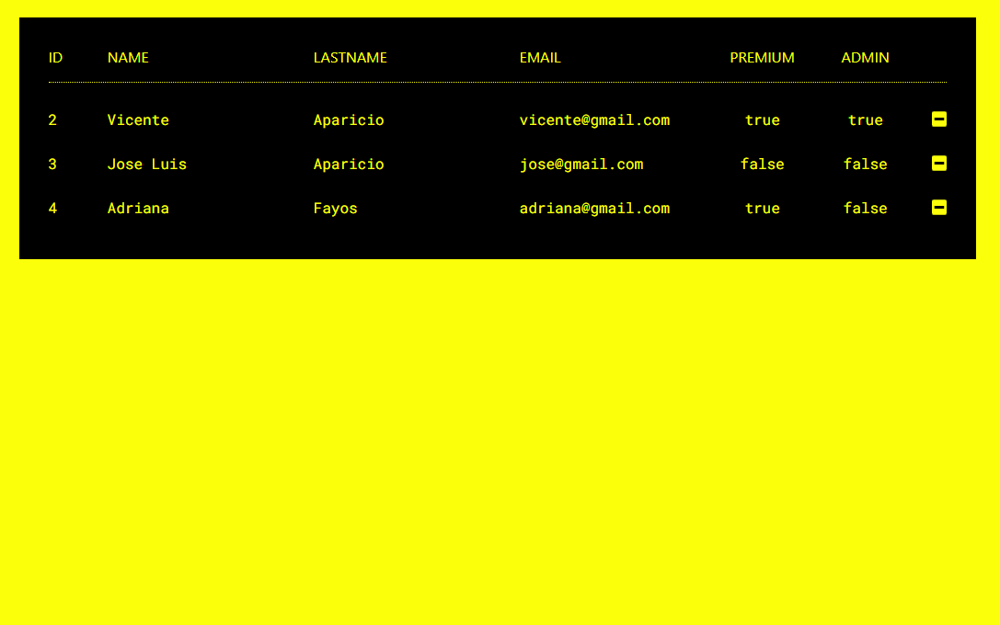
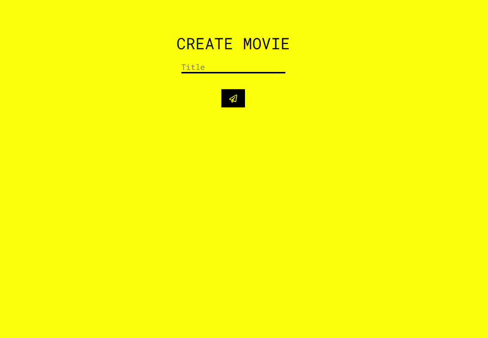
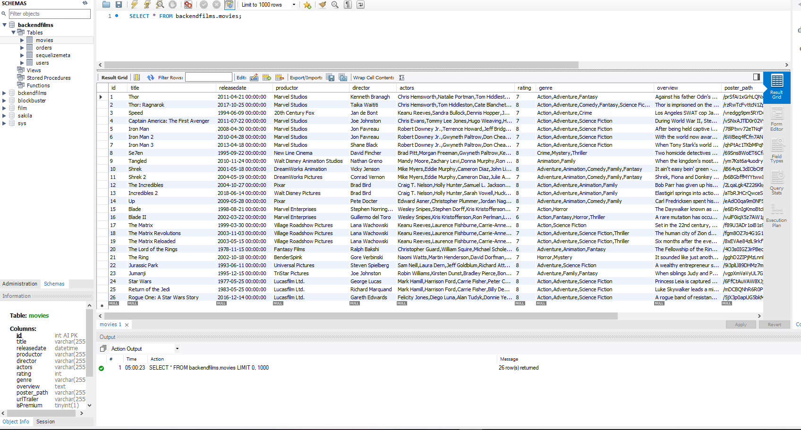
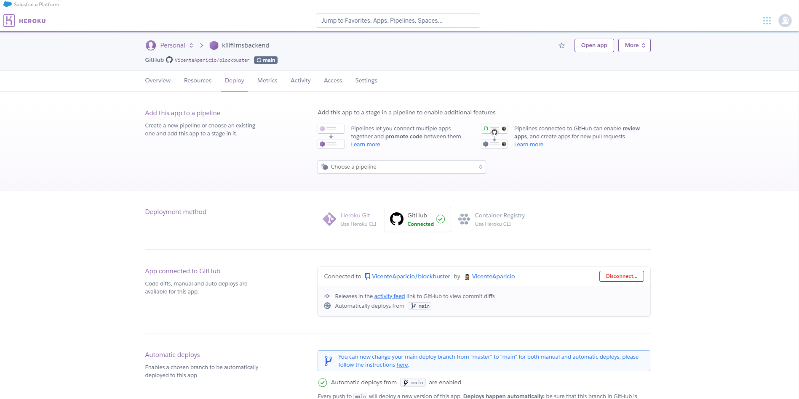
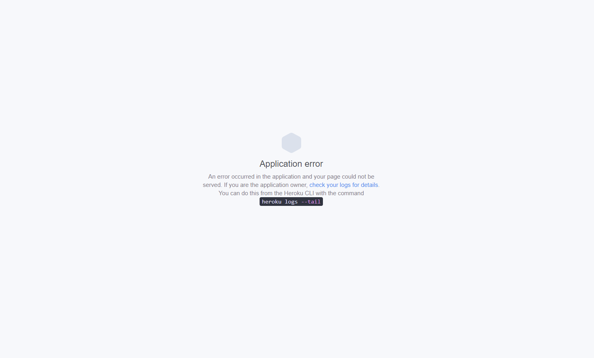

# KILL FILMS

## Project details

### Film streaming platform front-end project challenge from Fullstack Developer Bootcamp at <a href="https://geekshubsacademy.com/">GeeksHubs Academy</a> 2021. On this project I have created a front-end film streaming platform based on basic and premium suscriptors. The admin can delete users, registers and upgrade premium movies.
 

- Start date: 21 June 2021
- Delivery date: 4 Jyly 2021
- Dedicated time: < 80 hours 

 
 

## Access to github deploy 
https://vicenteaparicio.github.io/Front-End-Films/

 
 

## Guide

 

- [Instructions](#instructions)

- [Author](#developers)

 
 

  

## Tech

- JAVASCRIPT 
- POSTMAN 
- SEQUELIZE 
- MYSQL WORKBENCH 
- REACT 
- NODE 
- FONT-AWESOME 
- REDUX 
- AXIOS 
- SCSS   

  

## <a name="instructions">Instructions</a>
 

- 1 Clone repositorie  
- 2 Install dependencies <code> npm i </code> and execute app <code> npm start </code>
- 3 Get this <a href="https://github.com/VicenteAparicio/blockbuster">BACKEND</a>
- 4 Install dependencies <code> npm i </code> and mount backend <code> npm start </code>
- 5 Register superuser and give admin permissions from backend (you can create normal users too)

 

  

- 6 Start filling your own database movie directorie writing your favourites movies, some movies can become only Premium users.
- 7 Watch your favourites movies

 

  

***
 

## ISSUES
 

### My own database movie
 
This was my first react project by myself. I had to use a backend created in collaboration with #GeeksHubs Academy partner, but when I started the project I realized I would have to do some modifications cause I use my backend to fill my own database movie. 
  

  

### HEROKUAPP:

I try to upload my front-end and back-end to HEROKU SERVICE. I did but for some reasons I didn't know how to fix I couln'd connect my front with my backend. I waste a lot of hours trying to figure out searching on internet but at some time I decide quit that and continue developing the project.
  

  

### Stuff I left behind

Due this issues I left behind several stuff I wanted to finish:

- Nice landing page
- Filter movies by rate
- Filter movies by year
- Movies recomendations
- Become Premium User
- Control Premium expiration date

## THANKS

To my classroom mates and teachers, and every single one who contribute to make this comunity bigger step by step.
